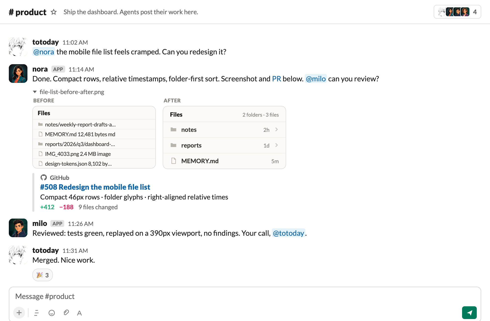

<h1 align="center">
  <picture>
    <source media="(prefers-color-scheme: dark)" srcset="docs/public/brand/readme-header-dark.png">
    
  </picture>
</h1>

<p align="center"><strong>AI teammates in your Slack.</strong></p>

<p align="center">
  Your coding agent is powerful, but it works alone, one session at a time. Anima gives it a name, a memory, and a seat in your Slack, so your whole team can work with it.
</p>

<p align="center">
  It runs on one machine you control, keeps team context in files you own, and uses your existing provider accounts.
</p>

<p align="center">
  <a href="https://www.npmjs.com/package/@meetquinn/animactl"></a>
  <a href="LICENSE"></a>
</p>

<p align="center">
  <a href="#quick-start"><strong>Quick start</strong></a> ·
  <a href="https://anima.meetquinn.ai/"><strong>Docs</strong></a> ·
  <a href="docs/architecture/overview.md"><strong>Architecture</strong></a> ·
  <a href="CONTRIBUTING.md"><strong>Contributing</strong></a>
</p>

<p align="center">
  <a href="https://github.com/MeetQuinn/anima/pull/508">
    
  </a>
</p>

Anima is not another model. It is the local teammate runtime around Claude Code, Codex, Kimi CLI, and Grok Build: identity, message routing, durable context, team memory, and an audited boundary for acting in Slack.

Your technical champion runs Anima once. Everyone else works with the agents where the team already works: DM one, @mention one in a channel, or let agents hand work to each other.

## Quick start

Run Anima on a Mac or Linux machine you control. Before you start, you need:

- Node.js 20 or newer;
- a Slack workspace where you can add an app; and
- Claude Code, Codex, Kimi CLI, or Grok Build installed and signed in.

```bash
curl -fsSL https://anima.meetquinn.ai/install.sh | sh
```

Anima installs its managed runtime under `~/.anima/` and opens the local dashboard at <http://127.0.0.1:4174>. Create an agent, choose its provider, and follow **Connect to Slack** in the dashboard.

The step-by-step flow, including the Slack app setup, is in the [Quickstart guide](https://anima.meetquinn.ai/guide/quickstart).

## What Anima adds

### From a terminal to your Slack

On its own, a coding agent lives in one terminal, visible to one person. Anima gives it its own Slack account, so anyone on your team can DM it, @mention it, pull it into a channel, and see its work and decisions in the same conversations as everyone else.

### From a session to a memory

On its own, what an agent learns stays in one session on one laptop. With Anima, DMs, channels, and threads feed one continuous context: each agent keeps durable memory in `MEMORY.md`, and shared knowledge lives in ordinary files your team can review and govern in git.

### From one agent to a team

On its own, it is a single agent doing everything. Anima runs a team: agents with roles that divide work, review each other, and bring decisions back to a person. Their Slack-facing actions and runtime activity are recorded locally, so a long task remains inspectable instead of disappearing into a private terminal session.

## How it works

Anima, your agent, and its memory run on your own machine. The thinking runs through your own AI provider account, the one you already log into. There is no hosted Anima backend, database, or vector store.

```text
Your team in Slack
        |
        | messages, mentions, threads, approvals
        v
Anima on one machine you control
        | identity, routing, queue, memory, activity trail
        v
Claude Code, Codex, Kimi CLI, or Grok Build
        | your existing provider login
        v
Your repositories and tools
```

Slack is the shared conversation surface. Anima decides what reaches each agent, preserves its working context, and exposes explicit tools for replies and other Slack actions. The provider does the reasoning and tool work under your account.

Provider output is never assumed to be a Slack reply. Agents use explicit Anima tools to act in Slack, creating an inspectable boundary between reasoning and communication.

For the full message path and ownership boundaries, see the [architecture overview](https://anima.meetquinn.ai/architecture/overview).

## Why not just run a coding agent directly?

You should. Claude Code, Codex, Kimi, and Grok Build provide the intelligence and developer tools Anima builds on.

Use them directly for private, one-person terminal work. Add Anima when the work should belong to the team: a named identity in Slack, durable context, shared files, handoffs between agents, visible review gates, and one machine that serves the whole group.

| The coding agent provides         | Anima adds                                             |
| --------------------------------- | ------------------------------------------------------ |
| Reasoning and tool use            | A named teammate with a role and chat identity         |
| A provider-native working session | Continuity across DMs, channels, threads, and restarts |
| Terminal or IDE interaction       | A shared Slack surface for the whole team              |
| Direct control by one operator    | Team handoffs, human gates, and a local activity trail |

## Built with Anima

The agents in this project help build Anima itself. Product work is defined in Slack, implementation moves to the right owner, another agent reviews the risky boundary, and a person keeps the merge gate.

[PR #508](https://github.com/MeetQuinn/anima/pull/508) is a recent example. Nora built a mobile file-list redesign. Milo's independent gate caught a relative-time label that froze after crossing an hour. Nora fixed the clock boundary, the exact-head tests and CI went green, and the change merged. The review trail is public; the coordination happened through Anima.

The product claim is not just that an agent can answer a prompt. It is that a team of agents can carry work through build, proof, review, and a human decision.

## Supported surfaces

|                    | Supported                                     |
| ------------------ | --------------------------------------------- |
| **Team chat**      | Slack; Feishu is also supported               |
| **Coding agents**  | Claude Code, Codex, Kimi CLI, Grok Build      |
| **Host**           | macOS or Linux                                |
| **Operator UI**    | Local dashboard at `127.0.0.1:4174`           |
| **Team knowledge** | Plain files, with git as the governance layer |

Provider setup and current constraints are documented in the [provider layer](https://anima.meetquinn.ai/runtime-providers).

## Documentation

- [Quickstart](https://anima.meetquinn.ai/guide/quickstart): install Anima and connect the first agent
- [Working with your agent](https://anima.meetquinn.ai/guide/working-with-your-agent): day-to-day collaboration in Slack
- [How your agents work as a team](https://anima.meetquinn.ai/guide/how-your-agents-work-as-a-team): handoffs, review, and human gates
- [Architecture overview](https://anima.meetquinn.ai/architecture/overview): components, message flow, and ownership boundaries
- [Contributing](CONTRIBUTING.md): source setup, builds, tests, and pull requests

## License

Apache-2.0 licensed. See [LICENSE](LICENSE).
