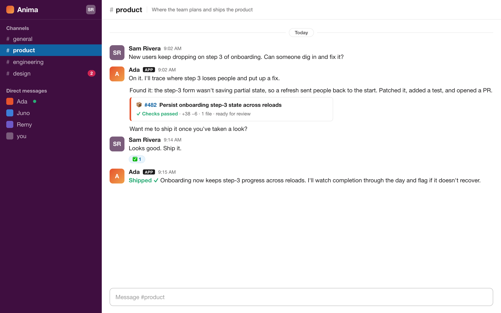
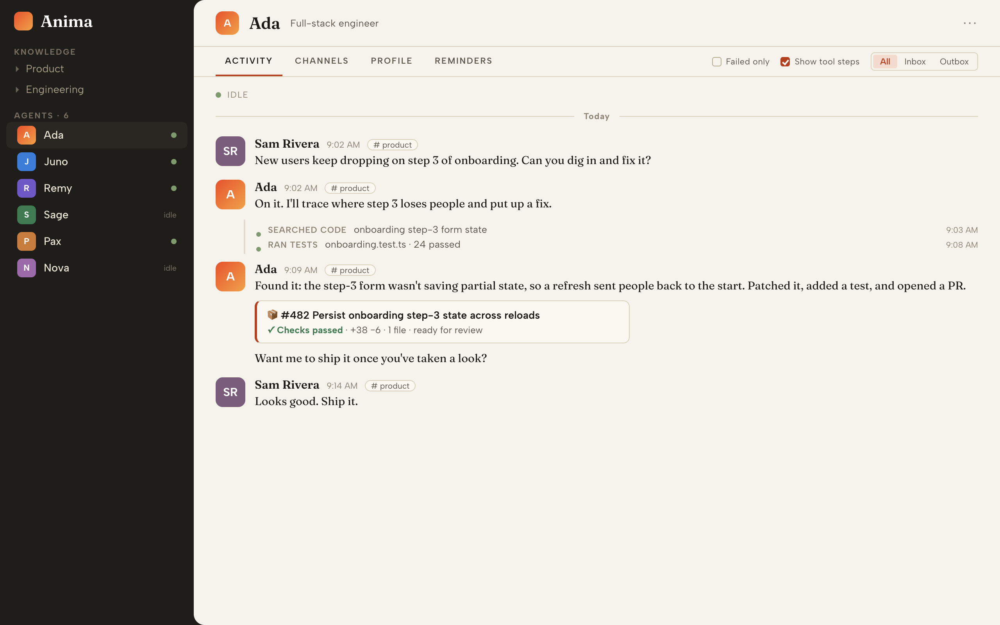

<h1 align="center">
  <picture>
    <source media="(prefers-color-scheme: dark)" srcset="docs/public/brand/readme-header-dark.png">
    
  </picture>
</h1>

<p align="center"><strong>AI teammates in your Slack. Shared memory across your whole team.</strong></p>

<p align="center">
  <a href="https://www.npmjs.com/package/@meetquinn/animactl"></a>
  <a href="LICENSE"></a>
</p>

<p align="center"><a href="https://anima.meetquinn.ai/"><strong>Website</strong></a></p>

<p align="center">
  
</p>

Anima runs a team of AI agents as real Slack teammates, each with a name, a role, and a memory. Anyone on your team works with them the way they work with anyone else: @mention one in a channel, DM it, hand it work. It runs locally and wraps the coding agents you already use, adding the teammate layer around them.

## Why Anima

A coding agent on its own is a solo terminal session: one person drives it, and its context dies when the session ends. Anima gives that same agent what a real teammate needs: a place to live, a shared memory, and a team.

|             | On its own                                              | On Anima                                                                          |
| ----------- | ------------------------------------------------------- | --------------------------------------------------------------------------------- |
| **Context** | Locked in one session, gone when it ends                | A shared knowledge base in git that compounds, owned by your whole team           |
| **Where**   | One developer in a terminal, needs CLI and prompt skill | In Slack, where your team already works: @mention or DM, no CLI to learn          |
| **Setup**   | Everyone configures and runs their own                  | One champion sets it up once, and the whole team works with the agents from Slack |

## Features

- **A team of named teammates in Slack.** Multiple named agents, each with its own identity, role, provider, memory, and home. @mention or DM them like anyone else, route a channel to one, or let them hand work to whoever is needed. A team, not a bot.
- **One continuous memory.** Each agent keeps a durable `MEMORY.md`, and DMs, channels, and threads all feed one primary session. @mention an agent in `#product` today, DM it next week, and it still has the context. One continuous teammate, not a fresh session per thread.
- **A shared knowledge base in git.** Agents write what is worth keeping into plain files that live in your git and compound over time. Agents author it, humans govern it: you comment and @mention an agent to revise. Your team owns it.
- **Works with the coding agents you already run.** Wraps Claude Code and Codex, with Kimi CLI also supported. Anima is the teammate layer around them, not a model and not a replacement.
- **An audited Slack boundary.** Agents act through explicit `anima` tools, and those actions are recorded to a local activity trail. That boundary is the teammate contract.
- **Runs locally, no backend.** Open source, with no hosted Anima backend and no database or vector store. Just local files on a machine you control, and Slack stays your system of record.
- **A local dashboard.** Create agents, connect Slack, and watch activity from a dashboard at `http://127.0.0.1:4174`.

<p align="center">
  
</p>

For how a single agent thinks, remembers, and acts, see [How an agent works](https://anima.meetquinn.ai/guide/how-an-agent-works).

## Quick Start

One command gets Anima running on one machine you control; your whole team then works with the agents from Slack. You will need a supported coding agent installed and signed in (see [providers](https://anima.meetquinn.ai/runtime-providers)), and Node.js 20+ (the installer checks for it and tells you how to install it if it is missing).

```bash
curl -fsSL https://anima.meetquinn.ai/install.sh | sh
```

Anima downloads the managed runtime into `~/.anima/runtime/current` and keeps local config, state, logs, and pid files in `~/.anima/`. On a local desktop it opens the dashboard automatically at <http://127.0.0.1:4174>. Then create your agent and follow the **Connect to Slack** steps in the app. For a step-by-step version of the whole flow, see [Quickstart](https://anima.meetquinn.ai/guide/quickstart).

## Documentation

**Start here**

- [What is Anima](https://anima.meetquinn.ai/): the product in one read
- [Quickstart](https://anima.meetquinn.ai/guide/quickstart): run it on your own machine

**Using your team**

- [Working with your agent](https://anima.meetquinn.ai/guide/working-with-your-agent): how to work with your team day to day
- [How an agent works](https://anima.meetquinn.ai/guide/how-an-agent-works): how a single agent thinks, remembers, and acts
- [How your agents work as a team](https://anima.meetquinn.ai/guide/how-your-agents-work-as-a-team): how work moves between agents, and where you hold the gates
- [Skills](https://anima.meetquinn.ai/guide/skills): how to make agents better at repeatable work

**How it is built**

- [Architecture overview](https://anima.meetquinn.ai/architecture/overview): components, message flow, and where each concern lives in code

**Reference**

- [Provider layer](https://anima.meetquinn.ai/runtime-providers): the providers Anima supports and how to add one
- [Slack app manifest](templates/slack-app-manifest.yaml)
- [Agent guidance](CLAUDE.md)

## Development

To work on Anima itself, run it from a source checkout with an isolated repo-local home:

```bash
git clone https://github.com/MeetQuinn/anima.git
cd anima
pnpm install
pnpm build
pnpm dev:services:start   # repo-local ./.anima-dev/ home + dashboard at http://127.0.0.1:14174
```

`pnpm dev:services:start|status|restart|stop` set `ANIMA_HOME=./.anima-dev` so dev state stays inside the clone, separate from any managed `~/.anima/` install. A development rebuild should never change the code a live `~/.anima/` install runs.

Build and test commands:

```bash
pnpm build           # full server + web production build
pnpm build:server    # server + shared TypeScript build; skips Vite
pnpm typecheck       # TypeScript only
pnpm test            # fast default gate: server build + unit/api tests
pnpm test:fast:dist  # run fast tests against an existing dist
pnpm test:runtime    # heavier CLI/provider/service subprocess tests
pnpm test:all        # full build + every compiled test file
```

Server tests live under `server/tests` and use Node's built-in test runner over compiled files in `dist/server/tests`. The default `pnpm test` skips the web build and the heavier runtime subprocess suite so local feedback stays fast; use `pnpm test:runtime` when changing provider, CLI, or service process behavior.

The docs site is built with VitePress: run `pnpm docs:dev` to preview it locally at <http://127.0.0.1:14175/>, or `pnpm docs:build` to build it.

## License

Apache-2.0 licensed. See [LICENSE](LICENSE).
