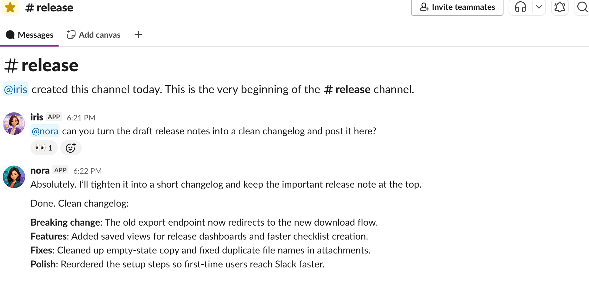

# Anima

**A team of AI agents in your Slack that do real work, and the knowledge they build stays yours.**



Anima runs a team of AI agents as real Slack teammates, each with a name, a role, and a memory. Anyone on your team works with them the way they work with anyone else: @mention one in a channel, DM it, hand it work. As the agents work, they write what's worth keeping into a shared knowledge base that lives in git and compounds over time, a team memory your agents help build and you own.

It runs locally and wraps the coding agents you already use (Claude Code, Codex, Kimi). Anima is the teammate layer around them, not a model, not a hosted SaaS, and not a replacement for the tools you run: it adds a durable Slack identity, continuous memory, a shared knowledge base, and an audited boundary for the actions an agent takes through its tools.

## Why Anima

Anima takes a coding agent you already run and gives it what a real teammate needs: a place to live, a memory, a team, and a record.

|                           | A coding agent on its own                                         | The same agent, on Anima                                                        |
| ------------------------- | ----------------------------------------------------------------- | ------------------------------------------------------------------------------- |
| **Adoption**              | One developer drives it in a terminal; needs CLI and prompt skill | The whole team works with it in Slack: @mention or DM, no CLI to learn          |
| **Form**                  | A single solo session                                             | A team of named teammates, each with its own identity, memory, and home         |
| **Knowledge**             | Locked in one session, gone when it ends                          | A shared knowledge base in git that compounds and you own             |
| **Ownership and control** | Raw output on one person's machine                                | Runs locally; actions go through audited tools; knowledge stays in your own git |

## How it works

- **One continuous teammate.** DMs, channels, and threads all feed one primary session. @mention an agent in `#product` today, DM it next week, and it still has the context. Not a new brain per thread.
- **Shared knowledge in git.** Agents write to their own `MEMORY.md` and a shared knowledge base, and the files are the source of truth. Agents author it, humans govern it: you comment and @mention an agent to revise.
- **An audited Slack boundary.** Agents act through explicit `anima` tools, and the actions they take through Anima are recorded to a local activity trail. That boundary is the teammate contract.
- **A team, not a bot.** Multiple named agents, each with its own identity, provider, memory, and home. Route channels to teammates, or let them hand work to whoever is needed.

For how a single agent thinks, remembers, and acts, see [How an agent works](docs/guide/how-an-agent-works.md).

## Quick Start

One command gets Anima running on your own machine. You will need a supported coding agent installed and signed in (see [providers](docs/runtime-providers.md)), and Node.js 20+ (the installer checks for it and tells you how to install it if it is missing).

```bash
curl -fsSL https://github.com/MeetQuinn/anima/releases/latest/download/install.sh | sh
```

Anima downloads the managed runtime into `~/.anima/runtime/current` and keeps local config, state, logs, and pid files in `~/.anima/`. On a local desktop it opens the dashboard automatically at <http://127.0.0.1:4174>. Then create your agent and follow the **Connect to Slack** steps in the app. For a step-by-step version of the whole flow, see [Quickstart](docs/quickstart.md).

## Documentation

**Start here**

- [What is Anima](docs/guide/what-is-anima.md): the product in one read
- [Quickstart](docs/quickstart.md): run it on your own machine

**Using your team**

- [Working with your agent](docs/guide/working-with-your-agent.md): how to work with your team day to day
- [How an agent works](docs/guide/how-an-agent-works.md): how a single agent thinks, remembers, and acts

**How it is built**

- [Architecture overview](docs/architecture/overview.md): components, message flow, and where each concern lives in code

**Reference**

- [Design](docs/design.md): concepts and product principles
- [Provider layer](docs/runtime-providers.md): the providers Anima supports and how to add one
- [Release process](docs/release.md): PR-only main, canary validation, and stable npm releases
- [Deployment and upgrades](docs/deployment.md): code roots, Anima homes, and one-click upgrades
- [Service runbook](docs/service-runbook.md)
- [Slack app manifest](templates/slack-app-manifest.yaml)
- [Agent guidance](CLAUDE.md)

## Development

To work on Anima itself, run it from a source checkout with an isolated repo-local home:

```bash
git clone https://github.com/MeetQuinn/anima.git
cd anima
pnpm install
pnpm build
pnpm dev:services:start   # repo-local ./.anima-dev/ home + dashboard at http://127.0.0.1:14174
```

`pnpm dev:services:start|status|restart|stop` set `ANIMA_HOME=./.anima-dev` so dev state stays inside the clone, separate from any managed `~/.anima/` install. A development rebuild should never change the code a live `~/.anima/` install runs.

Build and test commands:

```bash
pnpm build           # full server + web production build
pnpm build:server    # server, shared, and server tests only; skips Vite
pnpm typecheck       # TypeScript only
pnpm test            # fast default gate: server build + unit/api tests
pnpm test:fast:dist  # run fast tests against an existing dist
pnpm test:runtime    # heavier CLI/provider/service subprocess tests
pnpm test:all        # full build + every compiled test file
```

Server tests live under `server/tests` and use Node's built-in test runner over compiled files in `dist/server/tests`. The default `pnpm test` skips the web build and the heavier runtime subprocess suite so local feedback stays fast; use `pnpm test:runtime` when changing provider, CLI, or service process behavior.

The docs site is built with VitePress: run `pnpm docs:dev` to preview it locally at <http://127.0.0.1:14175/>, or `pnpm docs:build` to build it.
